 
# COS30043 - Interface Design and Development
Lab Exercises for third year unit: COS30043: Interface Design and Development, using HTML, CSS, JS, and Vue3 JS framework

## Lab Work Repository
**Student:** Ramisa Nawar

**University:** Swinburne University of Technology, Sarawak

---

## Lab 1
### Task 1
**Description:**
The classic Hello world! with HTML checker/validator

**Screenshot:**

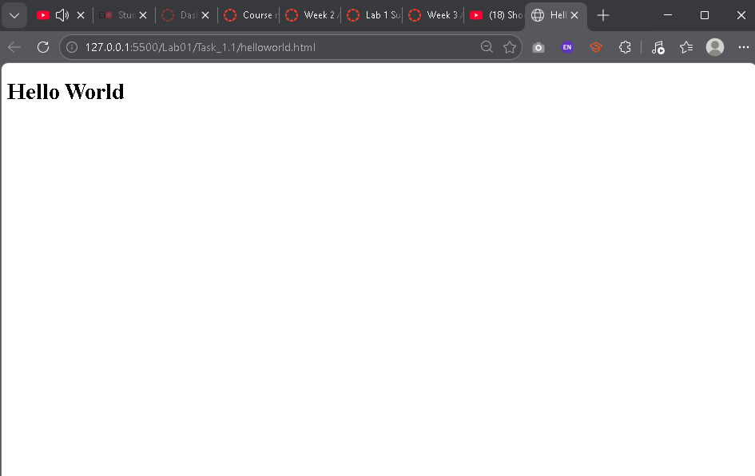

---

### Task 2
**Description:**
Learning to do table

**Screenshot:**

---

## Lab 2
### Task 2
**Description:**
Frontend of a calculator using Bootstrap

**Screenshot:**

---

### Task 3
**Description:**
Webpage demo template, to be used in multiple pages

**Screenshot:**
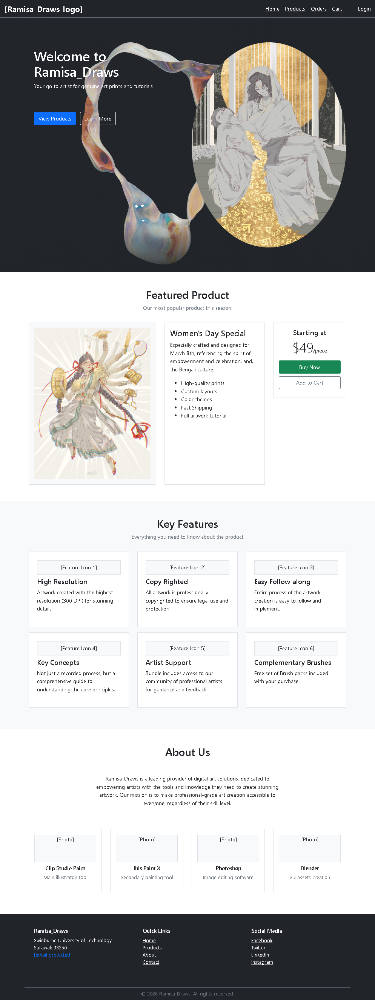

## Lab 3
### Task 1
**Description:**
Intro to vue3: string test: enter a name, results based on input

**Screenshot:**

---

### Task 2
**Description:**
Look up app: unit search filter: learning about v-for, v-mode, v-if, v-else, v-ifelse: filtering and viewing information based on input

**Screenshot:**

---

### Task 3
**Description:**
A Vue.js BMI calculator, shows result based on input height and weigth

**Screenshot:**

---

### Task 4
**Description:**
Registration App: Cloud Service, a Vue.js registration form that collects login credentials, validates password matching, and filters a phone model dropdown based on the selected operating system (Android, IOS, Windows).

**Screenshot:**

---

## Lab 4

### Task 1
**Description:**
A Vue.js number guesser. Allow user to guess number between 1 to 100. If guessed number is lower than the actual number, app prompts to guess higher, and vice versa. User can Give Up and see the actual number. User can also start over the game.

**Screenshot:**
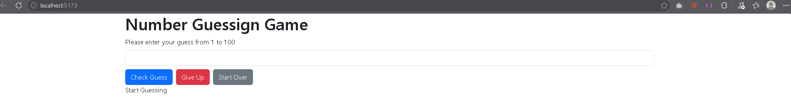
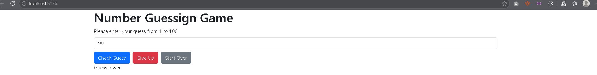
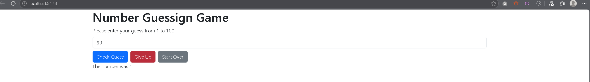
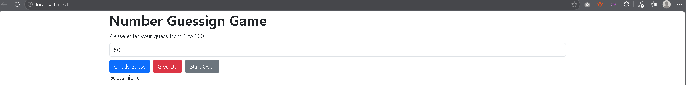

---

## Lab 5

### Task 1
**Description:**
A status posting app. You type a message, click Post, and it appears in a timeline. Each post has a Delete button. New posts go to the top. Teaches basic Vue components with methods (add/remove) and v-for.

**Screenshot:**
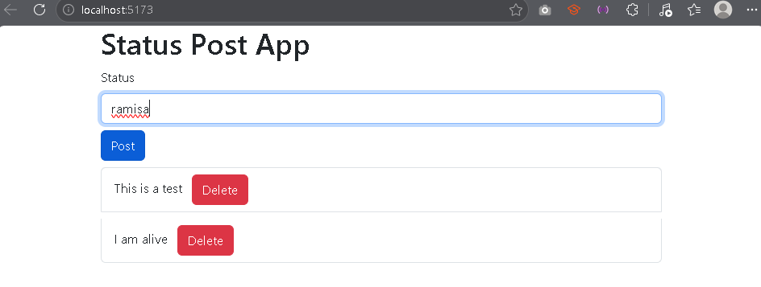
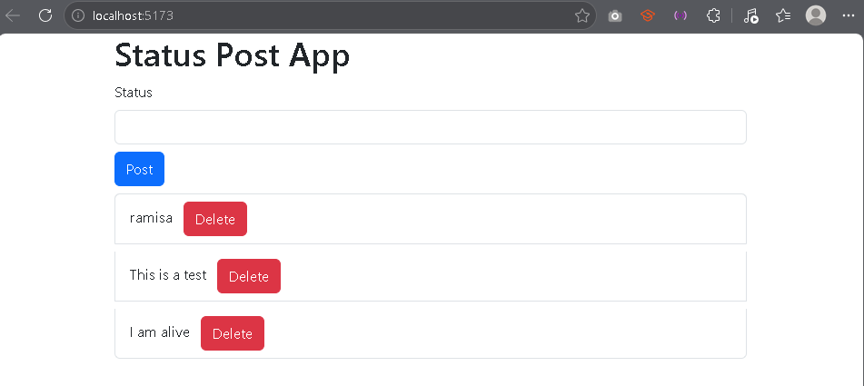
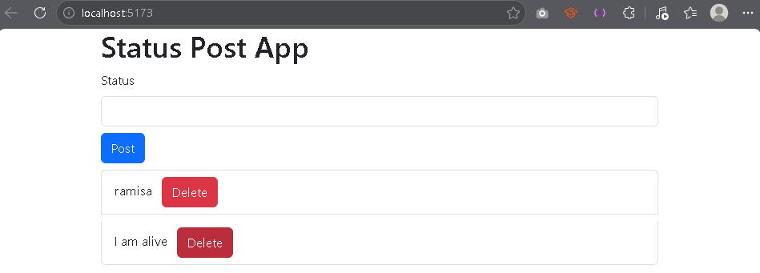

---

### Task 2
**Description:**
A Roman numeral converter.Enter a number (1–99) and it displays the Roman numeral equivalent.

**Screenshot:**
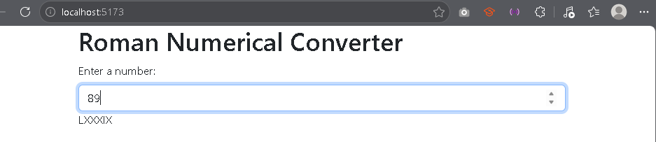

---

### Task 4
**Description:**
A unit information table with "show details" links. Clicking a link shows that unit's details below the table without reloading the page. Teaches dynamic routes and Vue Router.

**Screenshot:**
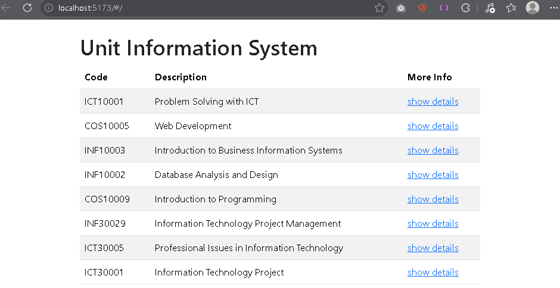
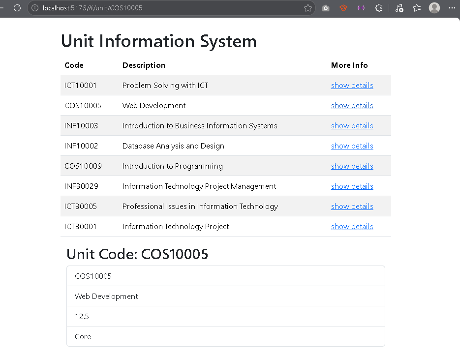

---

## Lab 6

### Task 1
**Description:**
A registration form built with **Vue.js** and **Vuetify** that performs client-side validation before submitting data to a server. Fields include personal details, account credentials, contact information, and address. Validation rules enforce requirements such as letters-only names, minimum password length with special characters, email format, 4-digit postcode, and Australian mobile number format (starting with 04). The form prevents submission until all errors are resolved. A toggle button shows/hides a Terms and Conditions section. On successful submission, form data is posted to a test server which displays the received values.

**Screenshots:**
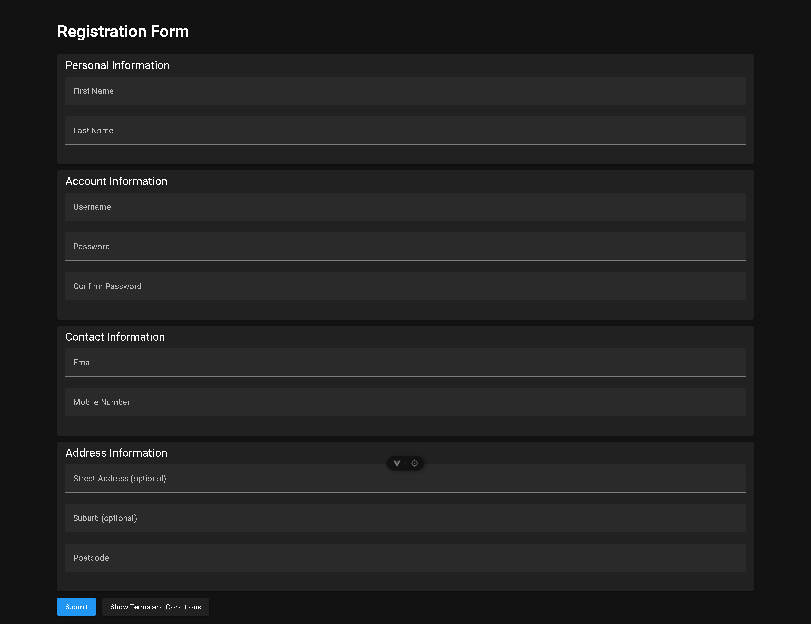
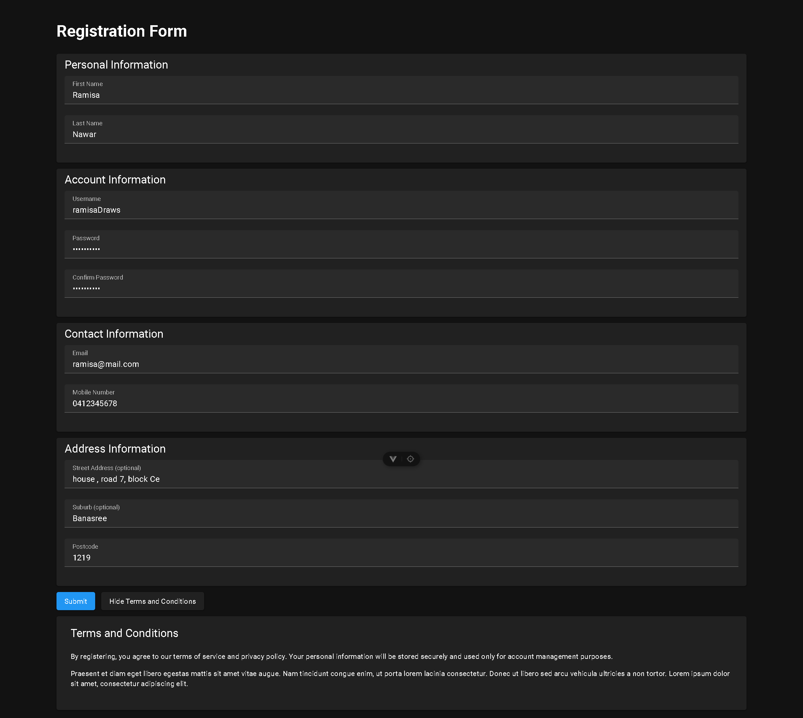
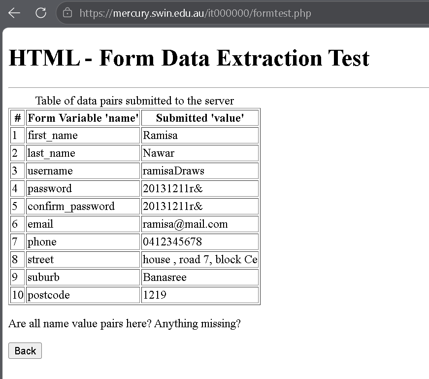
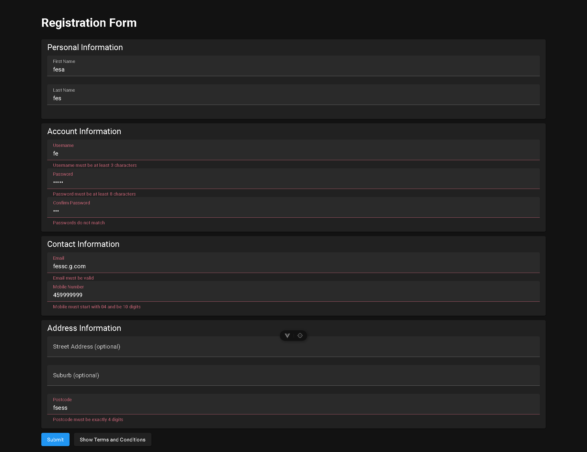

---

## Lab 7

### Task 1 & 2
**Description:**

**Posts Component**
Fetches a list of posts from the JSONPlaceholder API on mount using jQuery's $.getJSON, then renders them as a Bootstrap list group, displaying each post's ID and title.

**Unit Table Component**
Fetches unit data from a local units.json file on mount using the Fetch API, then renders it as a striped, bordered Bootstrap table showing each unit's code, description, credit points, and type.

**Screenshots:**

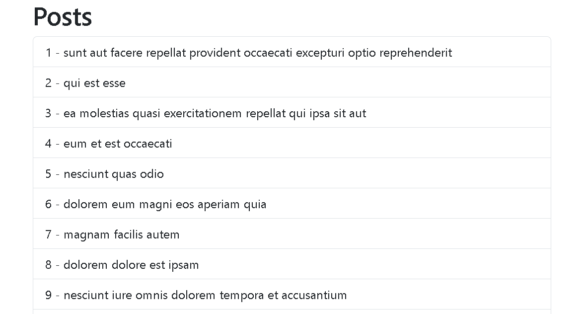
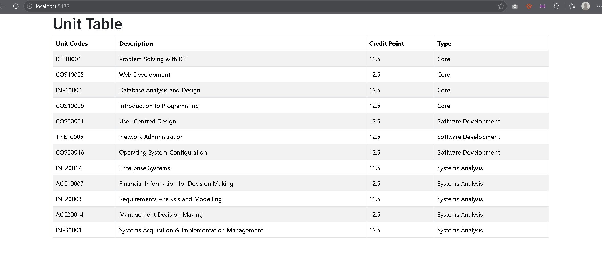
